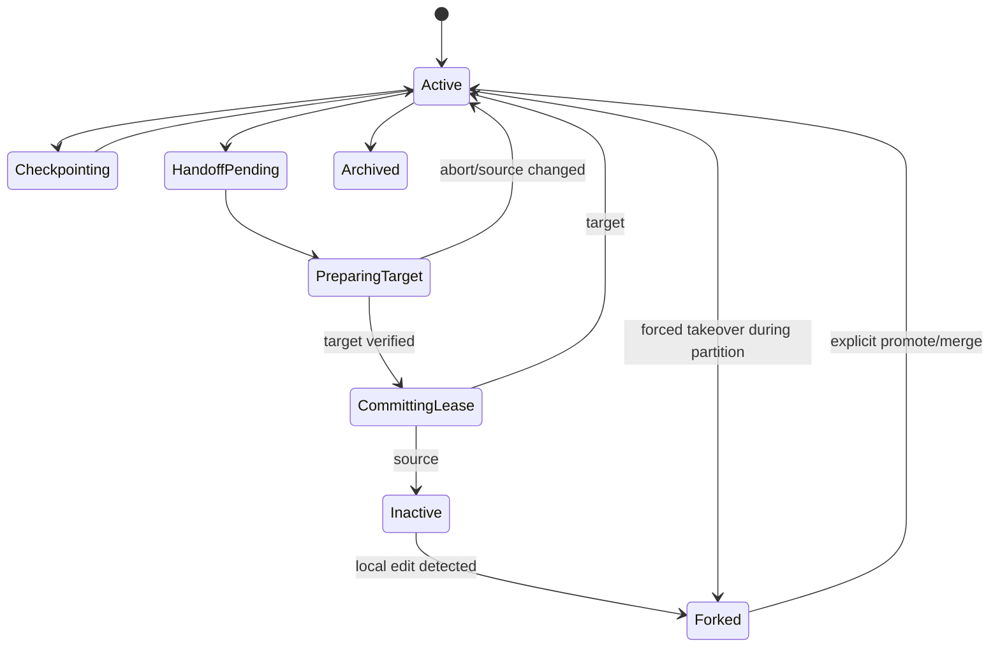
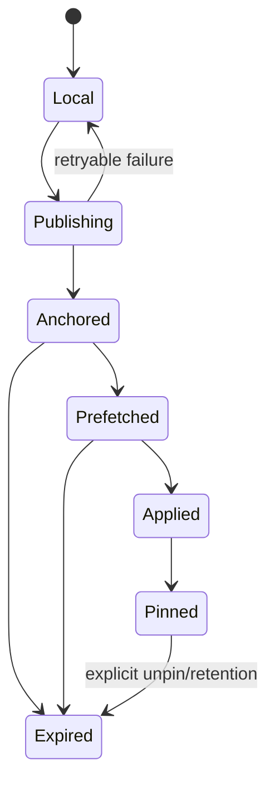
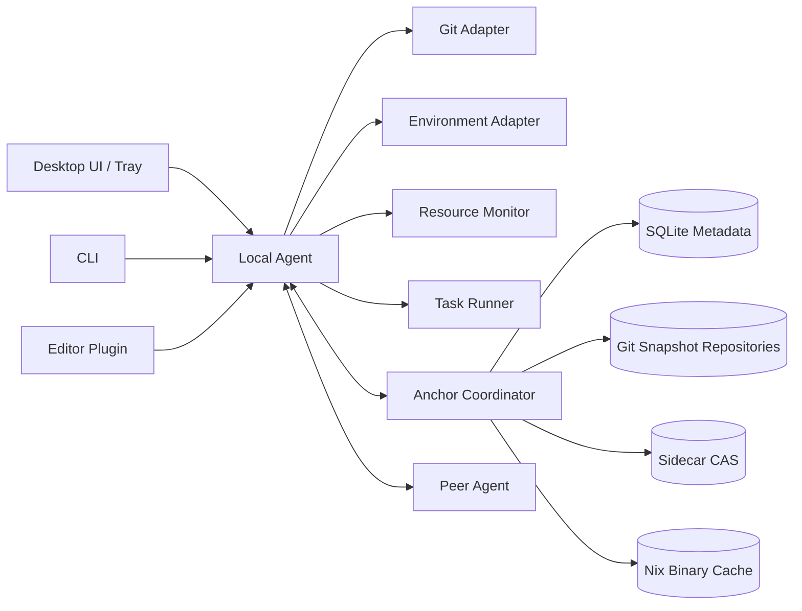
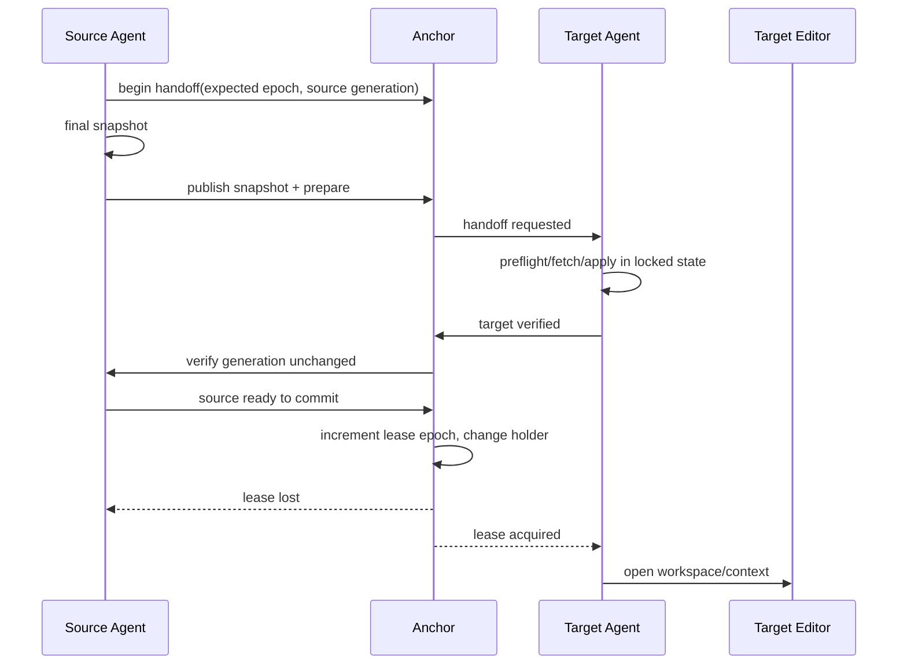

# DevRelay 북극성 제품·시스템 설계서

**문서 상태:** North Star / Product Requirement + Architecture + UX + Operations Specification  
**버전:** 1.0  
**대상:** 개인이 소유한 Windows·macOS·Linux·WSL 개발 머신, 동일 LAN 중심  
**제품 범주:** Personal Development Fabric  
**핵심 문장:** 파일 폴더를 공유하지 않고, 검증 가능한 개발 세션을 가장 적합한 머신으로 넘긴다.

---

## 0. 집행 요약

DevRelay는 Dropbox처럼 하나의 mutable working tree를 여러 머신에 복제하는 제품이 아니다. 각 머신은 독립된 정상 Git clone을 유지한다. DevRelay가 이동시키는 것은 다음으로 구성된 **개발 세션**이다.

- 기준 Git commit과 push하지 않은 commit
- staged·unstaged·untracked 상태
- 선택적으로 포함한 ignored 파일과 대용량 작업 파일
- 에디터의 열린 파일·커서·미저장 버퍼
- 환경 프로필과 secret의 논리적 참조
- 현재 이 세션을 수정할 수 있는 단 하나의 writer 권한
- 빌드·테스트 작업 정의와 결과

사용자의 북극성 경험은 다음과 같다.

> Mac에서 작업하다가 Linux 머신 앞에 앉아 **“여기서 계속”**을 누르면, 최신 안전 체크포인트가 검증된 상태로 적용되고, 환경이 준비되며, 에디터가 이전 문맥으로 열린다. 사용자는 commit, push, stash, patch, 파일 복사, 환경 재설정을 의식하지 않는다.

DevRelay는 두 개의 독립적인 문제를 한 제품 안에서 분리해 다룬다.

1. **Continuity plane:** 개발 세션의 보존·복제·handoff·복구
2. **Compute plane:** 빌드·테스트·에이전트 작업을 가장 적합한 유휴 머신에서 실행

환경은 Nix, Dev Container 또는 플랫폼별 bootstrap으로 **재생성**한다. `node_modules`, `.venv`, `target`, `.next`, Docker volume 같은 mutable 파생물은 동기화하지 않는다. 대신 Nix binary cache와 언어별 안전한 artifact cache를 활용한다.

---

# 1. 제품 정의

## 1.1 해결하려는 문제

사용자는 Windows, macOS, Linux 및 WSL 머신을 병행한다. 다음 문제가 반복된다.

- 다른 머신의 clone이 오래된 branch 또는 commit에 머물러 있다.
- push하지 않은 commit과 미커밋 변경이 원래 머신에 갇혀 있다.
- staged와 unstaged 구분, untracked 파일, merge 직전 상태가 사라진다.
- 환경변수와 toolchain, 패키지 캐시, 에디터 문맥이 일치하지 않는다.
- 어떤 머신이 현재 authoritative한 작업본인지 알기 어렵다.
- 고사양 머신이 놀고 있어도 빌드·테스트는 현재 머신에서만 실행된다.
- 폴더 동기화기를 사용하면 conflict copy, 부분 저장 상태, OS별 파일 차이와 생성물이 섞인다.

## 1.2 제품이 하지 않는 일

DevRelay의 명시적 비목표는 다음과 같다.

- 동일 working directory의 실시간 multi-master 파일 동기화
- Git, Nix, Docker, editor 자체를 대체
- process memory, kernel state, VM 전체를 다른 OS로 migration
- `node_modules` 및 빌드 디렉터리 복제
- 자동 Git conflict 해결
- LAN이 끊긴 동안의 무조건적인 single-writer 보장
- 사용자 동의 없이 원격 머신에서 임의 명령 실행
- 팀 협업 SaaS와 조직 권한 체계

## 1.3 제품 약속

DevRelay는 다음 네 가지를 약속한다.

1. **절대 조용히 덮어쓰지 않는다.** 대상 머신에 독자적 변경이 있으면 별도 세션으로 보존한다.
2. **적용한 상태는 검증한다.** Git tree, index manifest, sidecar content hash가 일치해야 성공이다.
3. **배경 작업은 눈에 띄지 않아야 한다.** CPU, 메모리, 네트워크, 배터리와 foreground 작업을 침해하지 않는다.
4. **일상 UI는 Git plumbing을 숨긴다.** 기본 동사는 `동기화`가 아니라 `계속하기`, `다른 곳에서 실행`, `복구`다.

## 1.4 북극성 지표

### North Star Metric: Verified Continuation Rate

`Verified Continuation Rate`는 사용자가 “여기서 계속”을 실행한 시도 중 다음 조건을 모두 충족한 비율이다.

- 대상 workspace가 사용자 개입 없이 준비됨
- source snapshot의 Git 상태가 hash 검증을 통과함
- 데이터 손실 또는 조용한 overwrite가 없음
- 환경 진입 또는 명확한 환경 오류 안내가 완료됨
- 사용자가 선택한 editor가 작업 문맥으로 열림

목표:

- Prefetched target: 95%가 5초 이내 코드 작업 가능
- Warm environment: 95%가 15초 이내 dev shell 진입
- 상태 충실도: 검증 가능한 지원 상태에서 100%
- 데이터 손실 허용치: 0
- 배경 checkpoint 성공률: 99.9% 이상

이 수치는 외부 사실이 아니라 제품 SLO다.

## 1.5 설계 원칙

### P1. Byte sync보다 semantic state

같아야 하는 것은 디렉터리의 순간적인 바이트 배열이 아니라 다음이다.

- base commit
- staged tree
- working tree overlay
- untracked classification
- environment fingerprint
- writer epoch
- user context

### P2. Immutable checkpoint, explicit mutable owner

Checkpoint는 immutable하다. Mutable한 것은 현재 active session뿐이며, 기본적으로 writer는 하나다.

### P3. Recreate, do not replicate

Toolchain과 dependency는 선언으로 재생성한다. 파생물을 복제하지 않는다.

### P4. Direct when possible, anchor when necessary

두 머신이 online이면 직접 전송한다. source가 잠들어도 이어갈 수 있도록 LAN anchor가 최신 checkpoint를 보관한다.

### P5. Progressive disclosure

기본 UI는 한 번의 클릭이다. Git ref, lease epoch, object store, environment hash는 고급 화면과 CLI에서만 보인다.

### P6. No surprise execution

받은 project manifest가 바뀌어도 승인 없이 hook이나 task를 실행하지 않는다.

---

# 2. 사용자·배포 가정

## 2.1 기본 사용자 환경

- 한 명의 사용자
- Windows desktop 또는 laptop
- macOS desktop 또는 laptop
- Linux workstation, mini PC, NAS 또는 home server
- 필요 시 WSL 2를 독립적인 개발 node로 취급
- 같은 LAN 또는 같은 로컬 trust domain
- 적어도 한 장치는 자주 켜져 있으며 anchor 역할 가능

## 2.2 권장 배치

```text
                       Control plane
                 ┌──────────────────────┐
                 │   Home Anchor        │
                 │  - coordinator       │
                 │  - snapshot cache    │
                 │  - metadata DB       │
                 │  - Nix cache         │
                 └──────────┬───────────┘
                            │
             ┌──────────────┼───────────────┐
             │              │               │
       ┌─────▼─────┐  ┌─────▼─────┐   ┌─────▼─────┐
       │ macOS     │  │ Windows   │   │ Linux     │
       │ Agent/UI  │  │ Agent/UI  │   │ Agent/UI  │
       └─────┬─────┘  └─────┬─────┘   └─────┬─────┘
             └──────────────┼───────────────┘
                            │
                    Direct P2P data plane
```

Anchor는 coordinator이지만 항상 데이터 중계자가 아니다. source와 target이 동시에 online이면 Git object와 sidecar chunk는 직접 전송하고, anchor는 lease와 상태 전이를 조정한다.

## 2.3 배포 모드

### Mode A. Anchor-first — 기본 권장

- Linux box, NAS 또는 항상 켜진 desktop이 anchor
- background checkpoint가 anchor에 복제됨
- source가 잠들어도 마지막 anchored checkpoint에서 계속 가능
- 가장 편하고 예측 가능함

### Mode B. Peer-only

- 별도 anchor 없음
- 하나의 online peer가 임시 coordinator
- source가 offline이면 최신 상태를 받을 수 없음
- 개인 실험용 또는 초기 MVP용

### Mode C. Anchor + backup anchor

- active coordinator는 하나
- backup은 metadata와 snapshot cache를 비동기 복제
- 자동 active-active 합의는 하지 않음
- root identity와 signed state를 이용해 수동 승격

---

# 3. 도메인 모델

## 3.1 핵심 객체

### Fabric

사용자의 개인 trust domain. Device identity, root trust, project membership을 포함한다.

### Device

하나의 실행 환경. 물리 머신과 동일하지 않을 수 있다.

- `desktop-windows-native`
- `desktop-wsl-ubuntu`
- `macbook-macos`
- `linux-workstation`

Windows native와 WSL은 별도 Device다.

### Project

논리적 software project. 여러 clone과 workspace를 묶는다.

### Workspace

특정 Device에 있는 Project의 실제 clone과 working directory.

### Session

하나의 독립적인 작업 흐름. Git branch와 보통 연관되지만 동일 개념은 아니다. Session은 branch를 바꿀 수 있고 detached HEAD를 가질 수도 있다.

### Snapshot

특정 시점의 immutable 개발 상태. parent snapshot을 가리키는 append-only chain을 이룬다.

### Lease

Session의 canonical writer를 나타내는 epoch 기반 권한. Lease가 없거나 잃은 workspace의 변경은 canonical session에 자동 반영하지 않고 fork로 보존한다.

### Context Capsule

Editor와 인간의 작업 문맥을 담는다.

- 열린 파일
- 커서·selection
- editor layout
- breakpoint
- 선택적 미저장 buffer
- terminal tab의 cwd와 제목
- 최근 실행한 승인된 task

### Environment Profile

특정 OS/architecture에서 개발환경을 만드는 선언.

- Nix
- Dev Container
- PowerShell/bootstrap script
- native tool manager

### Task

빌드, 테스트, lint, benchmark, agent run처럼 immutable snapshot을 입력으로 실행하는 작업.

### Artifact

Task가 만든 결과. 로그, junit XML, binary, coverage, screenshot 등이 될 수 있다.

## 3.2 불변 조건

- **INV-001:** Snapshot은 생성 후 수정되지 않는다.
- **INV-002:** canonical Session의 writer lease epoch는 단조 증가한다.
- **INV-003:** stale epoch의 publish는 canonical latest를 변경할 수 없다.
- **INV-004:** target에 독자적 변경이 있으면 적용 전에 recovery snapshot을 만든다.
- **INV-005:** background sync는 Git merge를 수행하지 않는다.
- **INV-006:** secret은 명시적 encrypted secret channel 외에는 snapshot에 포함되지 않는다.
- **INV-007:** remote command는 해당 command definition의 승인 hash가 일치할 때만 자동 실행할 수 있다.
- **INV-008:** snapshot apply 완료는 source/target state hash 검증 후에만 기록된다.

## 3.3 Session 상태 머신



## 3.4 Snapshot 상태 머신



---

# 4. 북극성 UX

## 4.1 UX의 중심 동사

UI에서 우선 사용하는 동사는 다음과 같다.

- **여기서 계속**
- **다른 컴퓨터에서 계속**
- **체크포인트 만들기**
- **다른 컴퓨터에서 실행**
- **이 상태로 복구**
- **두 작업 비교**

기본 화면에서 피해야 할 용어:

- refs
- packfile
- remote-tracking branch
- synthetic commit
- lease epoch
- object negotiation

이 용어는 진단 화면에서만 사용한다.

## 4.2 최초 설치·온보딩

### 1단계: 첫 장치

첫 실행 시 다음 중 하나를 고른다.

```text
DevRelay를 어디에 보관할까요?

● 이 컴퓨터를 Home Anchor로 사용
○ 기존 Home Anchor에 연결
○ 일단 peer-only로 사용
```

Home Anchor를 선택하면 Fabric identity와 recovery key가 생성된다. 복구 키는 OS keychain에 저장하고 사용자가 별도 보관할 수 있는 recovery phrase 또는 encrypted export를 제공한다.

### 2단계: 다른 장치 연결

새 장치에서 LAN의 anchor를 자동 발견한다. 사용자는 두 화면에 표시된 짧은 fingerprint가 같은지 확인한다.

```text
MacBook Pro를 연결하시겠습니까?

확인 코드: BLUE-RIVER-27

[연결 승인] [거부]
```

QR은 모바일 카메라가 없는 desktop 간에는 보조 수단이고, 기본은 short authentication string이다.

### 3단계: Project 가져오기

사용자가 허용한 root directory만 검색한다.

```text
발견한 Git 프로젝트 12개

✓ ~/Code/payments-api       기존 Project와 일치
✓ ~/Code/web                새 Project
○ ~/experiments/tmp         제외
```

Remote URL, root commit, 사용자 선택을 조합해 기존 Project와 매칭한다. 모호하면 자동 병합하지 않는다.

### 4단계: Environment 확인

DevRelay가 다음을 감지한다.

- `flake.nix`, `shell.nix`, `devenv.nix`
- `.devcontainer/devcontainer.json`
- `.tool-versions`, `mise.toml`, `rust-toolchain.toml`
- `packageManager`, lockfile
- Python·Node·Rust·Go·Java toolchain files

사용자에게 “이 프로젝트는 Nix로 준비”처럼 제안하고, 실행되는 명령을 보여준 뒤 trust를 받는다.

## 4.3 홈 화면

```text
┌─────────────────────────────────────────────────────────────┐
│ DevRelay                                      All systems ✓ │
├─────────────────────────────────────────────────────────────┤
│ 계속하던 작업                                                 │
│                                                             │
│ payments-api · feature/refund                               │
│ Mac Studio에서 작업 중 · 최신 체크포인트 8초 전              │
│ Linux Workstation 준비됨                                    │
│                                   [이 컴퓨터에서 계속]       │
├─────────────────────────────────────────────────────────────┤
│ Projects                                                    │
│ web          Linux에서 작업 중       Mac 준비됨              │
│ mobile       2시간 전 중단            환경 준비 필요          │
│ infra        이 컴퓨터에서 작업 중    안전하게 보관됨          │
├─────────────────────────────────────────────────────────────┤
│ Devices                                                     │
│ Mac Studio     active · AC · 18% CPU                        │
│ Linux Box      idle   · AC · warm cache                     │
│ Windows/WSL    online · battery                              │
└─────────────────────────────────────────────────────────────┘
```

첫 카드의 목적은 Project browser가 아니라 **작업 연속성**이다.

## 4.4 “여기서 계속” 흐름

Target에서 Project 카드의 버튼을 누른다.

```text
Mac Studio에서 하던 작업을 가져옵니다

✓ 코드 상태: 8초 전
✓ 미커밋 변경: 7개
✓ push하지 않은 commit: 2개
✓ Nix 환경: 준비됨
✓ VS Code 문맥: 준비됨

[계속하기]  [새 세션으로 열기]
```

버튼 후 내부 단계는 다음과 같지만 UI는 세 개의 의미 있는 상태만 표시한다.

```text
작업 상태 저장 중…
이 컴퓨터 준비 중…
제어권을 옮기는 중…
```

완료 후 editor가 열린다. 사용자는 Git 명령을 입력할 필요가 없다.

## 4.5 Source에서 “다른 컴퓨터에서 계속”

Tray 또는 editor command palette:

```text
Continue payments-api on…

Linux Workstation   Ready now
Windows WSL         Needs 430 MB environment
MacBook             Offline · last seen 3h
```

Target이 Ready면 one-click handoff다. 환경이 cold면 다음 선택을 제공한다.

- 준비가 끝나면 자동으로 열기
- 코드만 먼저 열기
- 취소

## 4.6 Handoff 중 source edit

Handoff가 1~2초 이상 걸릴 때 source editor는 다음 상태를 표시한다.

```text
Linux Workstation으로 넘기는 중입니다.
지금 편집하면 전송이 취소되고 새 체크포인트를 만듭니다.
```

OS 수준 강제 read-only는 기본 사용하지 않는다. 대신 editor plugin과 filesystem event를 함께 감시한다. 변경이 감지되면 handoff commit 전에 취소한다.

## 4.7 Inactive workspace에서 수정한 경우

절대 원격 canonical 상태에 섞지 않는다.

```text
이 작업은 현재 Linux Workstation에서 이어지고 있습니다.
Mac에서 새 변경 3개가 생겨 별도 작업으로 보관했습니다.

● 둘 다 보관
○ 나란히 비교
○ Git으로 합치기
○ 이 변경 버리기…
```

내부적으로 `session-fork`를 만들지만 기본 UI에서는 “별도 작업”이라고 표현한다.

## 4.8 Target에 기존 변경이 있는 경우

Target workspace가 dirty하면 기본 동작은 적용 거부가 아니라 **안전 보존 후 선택**이다.

```text
이 컴퓨터에도 저장되지 않은 작업이 있습니다.

[기존 작업을 별도로 보관하고 계속]
[새 폴더에서 열기]
[비교]
[취소]
```

“별도로 보관하고 계속”은 target local snapshot을 먼저 생성하고 fork session에 pin한 뒤 source snapshot을 적용한다.

## 4.9 복구 타임라인

Project detail에는 checkpoint를 Git commit과 별도로 보여준다.

```text
오늘
14:32  Linux로 넘기기 전               pinned
14:29  package.json 변경 후             safe
14:21  에디터 자동 체크포인트            safe
13:58  rebase 시작 전                    pinned
```

복구는 현재 상태를 파괴하지 않고 항상 새 Session으로 연다.

```text
[이 상태를 새 작업으로 열기]
```

## 4.10 Editor 문맥

Editor plugin이 있으면 다음을 복원한다.

- 열린 file과 tab order
- active file, cursor, selection
- split layout
- breakpoint
- 미저장 buffer
- terminal tab의 cwd와 이름

미저장 buffer는 disk snapshot과 별도인 encrypted context overlay다. Target editor는 이를 dirty buffer로 연다. 자동 저장하지 않는다.

실행 중인 process는 migration하지 않는다. 대신 승인된 `dev tasks`를 다시 시작할 수 있다.

## 4.11 알림 정책

알림은 다음 경우에만 보낸다.

- handoff target에서 user action 필요
- inactive workspace에서 divergence 발생
- checkpoint가 반복 실패해 최신 상태가 anchor에 없음
- disk quota 또는 secret block 때문에 보호가 중단됨
- remote task 완료 또는 실패

정상 background checkpoint마다 알림하지 않는다.

## 4.12 상태 단어

| UI 상태 | 의미 |
|---|---|
| 작업 중 | 이 Device가 active writer |
| 준비됨 | 최신 snapshot과 environment가 target에 있음 |
| 사용 가능 | snapshot은 있으나 environment hydrate 필요 |
| 보관 중 | anchor publish 진행 중 |
| 오프라인 | 최근 presence 없음 |
| 별도 작업 발생 | 비활성 Device에서 변경 발생 |
| 확인 필요 | secret, portability, dirty target 등으로 자동 진행 불가 |

색상만으로 상태를 전달하지 않고 icon과 text를 함께 사용한다.

## 4.13 CLI 동등성

```bash
devrelay status
devrelay continue linux-workstation
devrelay here payments-api
devrelay checkpoint
devrelay fork --name experiment
devrelay recover list
devrelay recover open <snapshot-id>
devrelay run test --on auto
devrelay run benchmark --on linux-box
devrelay doctor
devrelay explain <error-code>
```

GUI에서 가능한 핵심 작업은 CLI에서도 가능해야 하며, CLI 출력은 machine-readable JSON mode를 제공한다.

---

# 5. 정보 구조와 화면 명세

## 5.1 Tray/Menu bar

Tray는 가장 자주 쓰는 surface다.

```text
DevRelay
────────────
● payments-api · Mac에서 작업 중
  최신 체크포인트 5초 전

Continue on
  Linux Workstation      Ready
  Windows WSL            Available

Run elsewhere
  Test on Linux
  Build on Mac Studio

Open Dashboard
Pause background work
Quit
```

### Tray 요구사항

- 두 번의 click 이내에 handoff
- 현재 active project와 protection 상태 표시
- foreground bandwidth burst 취소 가능
- pause는 local checkpoint까지 막지 않고 network publish와 prewarm만 중단

## 5.2 Dashboard 탭

1. **Continue** — 최근 세션과 가장 가능성 높은 action
2. **Projects** — 프로젝트·세션·snapshot
3. **Devices** — presence, capability, resource, cache readiness
4. **Runs** — remote task queue와 결과
5. **Activity** — audit와 오류
6. **Settings** — Fabric, anchor, resource policy, security

## 5.3 Project detail

```text
payments-api

Active session: feature/refund
Writer: Mac Studio
Latest anchored: 11 sec ago

Work state
  2 unpushed commits
  3 staged / 4 unstaged / 1 untracked
  2 unsaved editor buffers

Availability
  Mac Studio       Active
  Linux            Ready
  Windows WSL      Code ready · env cold

[Continue here] [Continue on…] [Run task…]

Timeline | Sessions | Environment | Files | Advanced
```

## 5.4 Device detail

- OS, architecture, trust fingerprint
- online/idle/busy/sleeping
- AC/battery, battery saver
- free memory/disk
- current foreground load
- projects prefetched
- environment cache size
- allowed roles: anchor, compute, prewarm target
- resource caps

## 5.5 Advanced diagnostic view

다음 정보를 제공하되 기본 UI에는 숨긴다.

- snapshot ID, parent, tree OID
- head/index/work OID
- lease epoch
- transfer source와 route
- pack bytes, sidecar bytes
- apply verification result
- Git operation state
- excluded file reasons
- environment fingerprint
- structured logs export

---

# 6. 시스템 아키텍처

## 6.1 컴포넌트



### Local Agent

- long-running user service
- Project discovery와 workspace registry
- snapshot 생성·적용
- local checkpoint journal
- peer/anchor connection
- lease enforcement
- environment hydrate
- resource collection
- editor RPC

### Desktop UI

- agent의 thin client
- 상태를 직접 계산하지 않음
- agent event stream을 표시

### Editor Plugin

- 작업 문맥 제공
- active/inactive 표시
- unsaved buffer capsule
- handoff 중 edit 감지 보조
- 파일 전송이나 Git 조작은 하지 않음

### Anchor Coordinator

- Fabric membership
- device presence
- Project/Session/Snapshot metadata
- lease와 handoff state machine
- retention과 quota
- data route rendezvous

### Git Snapshot Store

- Project별 bare repository
- `refs/devrelay/*` namespace
- Git smart protocol v2 제공
- snapshot object와 unpushed history 보관

### Sidecar CAS

Git tree에 넣기 부적합한 데이터를 저장한다.

- 대용량 untracked/ignored file
- Git LFS object fallback
- editor unsaved buffer
- task artifact
- operation capsule

### Task Runner

- immutable snapshot을 isolated workspace에 적용
- 승인된 task 실행
- log와 artifact 회수
- active writer lease와 별개로 동작

## 6.2 Control plane과 data plane

### Control plane

작고 빈번한 메시지:

- presence
- lease
- snapshot metadata
- handoff state
- task state
- resource summary

Transport: HTTP/2 또는 QUIC 위 mTLS. 구현 초기에는 HTTP/2가 우선이다.

### Data plane

큰 데이터:

- Git pack
- CAS chunk
- Nix artifact
- task artifact

우선순위:

1. direct peer
2. anchor cache
3. upstream Git remote 또는 Nix substituter

## 6.3 LAN discovery

동일 link에서 mDNS/DNS-SD를 사용한다.

```text
_devrelay-anchor._tcp.local
_devrelay-peer._tcp.local
```

TXT record에는 다음만 넣는다.

```text
protocol=1
fabric_hint=<truncated-hash>
device_id=<public-id>
port=47821
```

Project 이름, username, repository path는 광고하지 않는다.

## 6.4 로컬 IPC

- macOS/Linux: Unix domain socket
- Windows: Named Pipe
- payload: versioned JSON-RPC 또는 protobuf
- UI와 editor plugin은 local agent만 호출
- network certificate private key는 UI process가 접근하지 않음

## 6.5 Metadata DB

개인용 active anchor는 SQLite WAL을 사용한다. 분산 consensus를 만들지 않는다.

핵심 table:

```sql
CREATE TABLE devices (
  id TEXT PRIMARY KEY,
  name TEXT NOT NULL,
  platform TEXT NOT NULL,
  certificate_fingerprint TEXT NOT NULL,
  capabilities_json BLOB NOT NULL,
  paired_at TEXT NOT NULL,
  last_seen_at TEXT
);

CREATE TABLE projects (
  id TEXT PRIMARY KEY,
  name TEXT NOT NULL,
  canonical_remote_fingerprint TEXT,
  created_at TEXT NOT NULL
);

CREATE TABLE workspaces (
  id TEXT PRIMARY KEY,
  project_id TEXT NOT NULL,
  device_id TEXT NOT NULL,
  local_path TEXT NOT NULL,
  platform_profile TEXT,
  state TEXT NOT NULL,
  UNIQUE(project_id, device_id, local_path)
);

CREATE TABLE sessions (
  id TEXT PRIMARY KEY,
  project_id TEXT NOT NULL,
  name TEXT NOT NULL,
  parent_session_id TEXT,
  created_at TEXT NOT NULL,
  archived_at TEXT
);

CREATE TABLE snapshots (
  id TEXT PRIMARY KEY,
  project_id TEXT NOT NULL,
  session_id TEXT NOT NULL,
  parent_snapshot_id TEXT,
  sequence_number INTEGER NOT NULL,
  author_device_id TEXT NOT NULL,
  lease_epoch INTEGER NOT NULL,
  head_oid TEXT NOT NULL,
  index_state_json BLOB NOT NULL,
  work_commit_oid TEXT,
  context_capsule_id TEXT,
  environment_fingerprint TEXT,
  metadata_json BLOB NOT NULL,
  signature BLOB NOT NULL,
  created_at TEXT NOT NULL,
  anchored_at TEXT,
  pinned INTEGER NOT NULL DEFAULT 0,
  UNIQUE(session_id, sequence_number)
);

CREATE TABLE leases (
  session_id TEXT PRIMARY KEY,
  epoch INTEGER NOT NULL,
  holder_device_id TEXT,
  state TEXT NOT NULL,
  latest_snapshot_id TEXT,
  handoff_id TEXT,
  updated_at TEXT NOT NULL
);

CREATE TABLE handoffs (
  id TEXT PRIMARY KEY,
  session_id TEXT NOT NULL,
  source_device_id TEXT NOT NULL,
  target_device_id TEXT NOT NULL,
  snapshot_id TEXT,
  expected_epoch INTEGER NOT NULL,
  state TEXT NOT NULL,
  source_generation INTEGER NOT NULL,
  created_at TEXT NOT NULL,
  expires_at TEXT NOT NULL
);

CREATE TABLE task_runs (
  id TEXT PRIMARY KEY,
  project_id TEXT NOT NULL,
  snapshot_id TEXT NOT NULL,
  task_name TEXT NOT NULL,
  target_device_id TEXT,
  environment_fingerprint TEXT NOT NULL,
  state TEXT NOT NULL,
  exit_code INTEGER,
  result_cache_key TEXT,
  created_at TEXT NOT NULL,
  finished_at TEXT
);
```

---

# 7. Snapshot 데이터 모델

## 7.1 정상 Git 상태

정상적인 fully merged index에서는 세 개의 논리 상태를 만든다.

```text
H = 실제 HEAD commit
I = 현재 index tree를 가리키는 synthetic commit
W = 현재 working state를 가리키는 synthetic commit

H <- I <- W
```

- `diff(H, I)`는 staged 변경
- `diff(I, W)`는 unstaged 변경과 포함된 untracked file
- W에서 H까지 도달 가능하므로 unpushed commit history도 transfer 가능

Synthetic commit은 사용자 branch에 나타나지 않는다.

## 7.2 Snapshot metadata 예시

```json
{
  "schema_version": 1,
  "snapshot_id": "01K2...",
  "project_id": "01K1...",
  "session_id": "01K1...",
  "parent_snapshot_id": "01K2...",
  "sequence": 184,
  "device_id": "mac-studio",
  "lease_epoch": 27,
  "created_at": "2026-06-22T15:10:31Z",
  "branch": "feature/refund",
  "head_oid": "a10f...",
  "index": {
    "kind": "tree",
    "tree_oid": "b21a...",
    "commit_oid": "c832...",
    "supplemental_flags": []
  },
  "work": {
    "tree_oid": "d42b...",
    "commit_oid": "e908..."
  },
  "untracked": ["notes/refund-cases.md"],
  "excluded": [
    {"path": ".env", "reason": "secret-policy"},
    {"path": "node_modules", "reason": "derived-directory"}
  ],
  "sidecars": [],
  "operation": {"kind": "normal"},
  "context_capsule_id": "ctx_...",
  "environment_fingerprint": "env_...",
  "portability": {
    "windows": "ok",
    "macos": "ok",
    "linux": "ok"
  }
}
```

## 7.3 Index supplemental manifest

Tree object가 표현하지 못하는 index 정보는 별도 manifest에 둔다.

- intent-to-add
- skip-worktree
- assume-unchanged
- sparse index 관련 논리 상태
- unmerged stage 1/2/3 entries

FSMonitor와 untracked cache extension은 전송하지 않고 target에서 재생성한다.

Unmerged index 예시:

```json
{
  "kind": "entries",
  "entries": [
    {"path":"src/api.ts","stage":1,"mode":"100644","oid":"..."},
    {"path":"src/api.ts","stage":2,"mode":"100644","oid":"..."},
    {"path":"src/api.ts","stage":3,"mode":"100644","oid":"..."}
  ],
  "flags": []
}
```

## 7.4 Git operation capsule

지원 수준을 명확히 나눈다.

### Tier 0 — 완전 지원

- normal working state
- detached HEAD
- staged/unstaged/untracked
- push하지 않은 commit

### Tier 1 — 지원

- merge conflict
- cherry-pick conflict
- revert conflict

Index stage entry와 필요한 control metadata를 안정된 내부 schema로 직렬화한다.

### Tier 2 — 제한 지원

- interactive rebase
- sequencer가 포함된 복잡한 multi-step operation

초기 구현에서는 handoff 전에 다음 선택을 제공한다.

- 현재 conflict 상태를 별도 Session으로 열기
- operation 시작 전 checkpoint로 복구
- source에서 operation을 마친 뒤 넘기기

North Star 구현은 Git 내부 디렉터리를 그대로 복사하지 않고, rebase todo, original head, onto, current step을 내부 schema로 변환한 뒤 target Git 버전에 맞게 재구성한다.

## 7.5 대용량·비Git sidecar

다음은 Git object 대신 CAS에 저장할 수 있다.

- threshold 이상의 untracked file
- 사용자가 명시적으로 포함한 ignored working asset
- Git LFS local object
- editor unsaved buffer
- task output

CAS entry:

```json
{
  "logical_path": "fixtures/large-dump.bin",
  "size": 314572800,
  "content_hash": "b3:...",
  "chunks": [
    {"hash":"b3:...","size":4194304},
    {"hash":"b3:...","size":3872011}
  ],
  "mode": "100644",
  "classification": "working-file"
}
```

Content-defined chunking과 per-project content address를 사용해 일부 변경만 다시 전송한다. 구현은 bounded-memory streaming이어야 한다.

## 7.6 Source object isolation

Untracked content를 사용자의 main `.git/objects`에 오래 남기지 않기 위해 source에는 별도 snapshot object store를 둔다.

```text
$DEVRELAY_DATA/projects/<project>/<workspace>/snapshots.git
```

Snapshot 생성 시:

- main repository config와 attributes를 사용
- object write target만 side store로 설정
- side store는 main object store를 alternate로 읽음
- main에는 snapshot base HEAD를 지키는 작은 keepalive ref만 둠
- synthetic tree/commit과 untracked blob은 side store에 존재

Snapshot 만료 시 side ref와 main base keepalive ref를 함께 삭제한다.

Target은 적용 후 실제 index와 향후 commit이 필요한 object를 main object store에 import한다.

## 7.7 Secret classification

다음은 기본 hard block 후보이며 자동 포함하지 않는다.

- `.env`, `.env.*`
- private key와 certificate private material
- `.ssh`, cloud credential directory
- OS keychain export
- token cache
- socket, pipe, PID, lock file
- browser profile와 cookie DB

Path rule뿐 아니라 content detector를 사용한다. 오탐 시 사용자는 다음 중 하나를 선택한다.

- 계속 제외
- secret provider reference로 전환
- 이 snapshot 한 번만 encrypted sidecar로 포함

평문 Git object 포함은 허용하지 않는 것이 기본 정책이다.

---

# 8. Snapshot 생성·적용 알고리즘

## 8.1 Trigger

Agent는 OS filesystem watcher를 진실의 원천으로 사용하지 않는다. Watcher는 “변경 가능성” 신호다.

Trigger:

- file event 후 adaptive debounce
- Git index 변경
- editor buffer 변경 event
- explicit checkpoint
- handoff
- screen lock 또는 sleep 직전
- branch/HEAD 변경
- operation 시작 전
- 최대 dirty interval 초과

## 8.2 Repository lock

Snapshot 생성 전:

1. workspace-level DevRelay mutex 획득
2. `.git/index.lock` 등 Git mutation lock 검사
3. 짧게 재시도
4. 장시간 lock이면 snapshot을 지연하고 UI에 보호 지연 표시

사용자 Git 명령을 죽이거나 lock file을 임의 삭제하지 않는다.

## 8.3 상태 수집

```text
1. HEAD, branch, upstream 확인
2. git operation 확인
3. porcelain v2 -z 상태 수집
4. untracked/ignored candidate 분류
5. secret·portability policy 적용
6. source generation counter 기록
```

`source generation`은 filesystem event와 index change마다 증가한다. Handoff 동안 generation이 바뀌면 final commit을 중단한다.

## 8.4 정상 index snapshot

개념 알고리즘:

```text
H = resolve HEAD
I_TREE = write current index tree
I_COMMIT = commit-tree(I_TREE, parent=H)

TEMP_INDEX = copy current index
CHANGED_PATHS = unstaged changes + accepted untracked + deletions
stage CHANGED_PATHS into TEMP_INDEX
W_TREE = write TEMP_INDEX tree
W_COMMIT = commit-tree(W_TREE, parent=I_COMMIT)
```

전체 tree를 다시 hash하지 않는다. Git status가 알려준 변경 path만 임시 index에 반영한다.

## 8.5 Filter와 line-ending

기본은 Git semantic snapshot이다.

- `.gitattributes`와 clean/smudge filter를 존중
- target platform의 checkout 규칙을 적용
- raw byte equality가 필요한 path는 `byte_exact=true` sidecar로 별도 지정
- non-deterministic filter가 감지되면 자동 handoff를 막고 설명

## 8.6 Untracked 정책

기본 `safe` 모드:

- Git ignore 대상이 아닌 untracked source file 포함
- known generated directory 제외
- secret candidate 제외
- single file size threshold 이상은 sidecar 또는 확인
- device socket, FIFO, special file 제외

Mode:

- `none`: untracked 제외
- `safe`: 안전 분류만 자동 포함
- `all-nonignored`: secret 제외 후 모두 포함
- `explicit`: manifest include만 포함

## 8.7 Anchor publish

```text
1. local immutable snapshot ref 생성
2. metadata 서명
3. direct/anchor route 선택
4. Git snapshot ref push
5. CAS missing chunk query 후 upload
6. coordinator에 metadata 등록
7. lease epoch와 source device 확인
8. canonical latest pointer compare-and-swap
9. event 발행
```

Canonical update 조건:

```sql
UPDATE leases
SET latest_snapshot_id = ?, updated_at = ?
WHERE session_id = ?
  AND epoch = ?
  AND holder_device_id = ?
  AND state = 'active';
```

영향 row가 하나가 아니면 snapshot은 보존되지만 canonical latest가 되지 않는다.

## 8.8 Target preflight

- target workspace mapping 존재 여부
- target dirty state
- disk quota
- path portability
- symlink capability
- required Git object availability
- environment profile compatibility
- command trust
- editor plugin compatibility

Preflight는 working tree를 변경하지 않는다.

## 8.9 Target apply

일반 상태의 순서:

```text
1. target local changes를 recovery snapshot으로 보존
2. base H와 필요한 history를 main object store에 fetch
3. W/I object와 sidecar를 staging area에 fetch
4. branch mapping 결정
5. workspace를 H의 clean 상태로 맞춤
6. W tree를 working tree에 적용
7. I tree 또는 index manifest를 index에 적용
8. sidecar working files materialize
9. editor context capsule 준비
10. source와 동일한 state hash 재계산
11. 검증 성공 표시
```

순서가 `W 적용 → I index 설정`인 이유는 staged/unstaged 구분을 보존하기 위해서다.

## 8.10 Apply verification

다음을 비교한다.

- HEAD OID
- index tree 또는 canonical index manifest hash
- work tree hash
- included untracked content hash
- sidecar chunk root hash
- operation capsule hash

미저장 editor buffer는 editor plugin이 별도 ACK한다.

어느 하나라도 다르면 target을 active로 열지 않고 recovery 상태로 둔다.

## 8.11 Handoff protocol



Handoff commit 직전 source generation이 달라지면 target apply를 rollback하거나 recovery snapshot으로 남기고 handoff를 재시도한다.

## 8.12 Offline·partition

- Current holder는 anchor가 잠시 끊겨도 local 작업 가능
- 새 Device는 canonical lease를 자동 탈취하지 않음
- 마지막 anchored snapshot에서 계속하려면 기본적으로 fork 생성
- 강제 takeover는 분기 가능성을 명확히 경고
- source가 돌아오면 stale epoch publish는 거부되고 local work는 fork로 보존

## 8.13 Idempotency

모든 network mutation은 idempotency key를 가진다.

- snapshot publish: snapshot ID
- handoff prepare/commit: handoff ID
- CAS chunk upload: content hash
- task run: run ID

재시도해도 중복 snapshot, lease 이중 증가, artifact 중복 생성이 없어야 한다.


---

# 9. 최적 자원 관리 설계

## 9.1 자원 관리 목표

DevRelay는 다음 두 관점에서 자원을 최적화한다.

1. **자기 자신이 적게 소비:** idle CPU, RAM, disk write, battery, LAN bandwidth 최소화
2. **사용자의 전체 장비를 잘 활용:** 유휴 CPU·RAM·GPU·OS capability를 빌드·테스트·에이전트 작업에 배치

두 목표가 충돌하면 interactive UX와 데이터 안전을 우선한다.

## 9.2 자원 예산 SLO

다음은 기본 profile의 목표치다.

| 항목 | Idle 목표 | Active checkpoint 목표 |
|---|---:|---:|
| Agent CPU | 장시간 평균 0.5% 미만 | foreground를 방해하지 않는 bounded burst |
| Agent RSS | 100 MiB 미만 | 250 MiB 미만, 대형 파일은 streaming |
| Disk write | 변경 데이터 중심 | 전체 working tree 재복사 금지 |
| Background LAN | 측정 대역폭의 20% 이하 | handoff 시 최대 80%까지 일시 burst |
| Snapshot latency | 해당 없음 | 일반 변경 p95 1초 이내 local checkpoint |
| Anchor publish lag | 해당 없음 | 정상 LAN에서 p95 30초 이내 |
| Wake-up | event-driven | polling 최소화 |

대규모 monorepo, 수십 GB binary change, 느린 HDD에서는 별도 budget profile을 적용한다.

## 9.3 Adaptive checkpoint cadence

고정 주기로 전체 scan하지 않는다.

### 기본 Balanced 정책

- 첫 file event 후 2.5초 quiet 시 local checkpoint 후보
- 마지막 local checkpoint 후 최소 5초 간격
- dirty 상태가 지속되면 최대 60초마다 local safety checkpoint
- 10초 quiet 시 anchor publish
- 편집이 계속돼도 최대 120초마다 anchor publish
- handoff, sleep, lock, shutdown signal 시 즉시 flush

### Event coalescing

```text
many file events
    -> path set union
    -> quiet-window debounce
    -> one Git status
    -> one snapshot
```

Formatter가 수백 file을 건드려도 path별 job을 생성하지 않는다.

## 9.4 Git-aware scan 최적화

DevRelay는 자체적으로 모든 file을 매번 stat/hash하지 않는다.

- Git의 built-in FSMonitor 사용 가능 여부 확인
- untracked cache 사용 가능 여부 확인
- `git status --porcelain=v2 -z`를 machine interface로 사용
- 변경 path만 temporary index에 stage
- unchanged blob/tree는 content address로 재사용

Project 등록 시 config 변경은 사용자에게 보여주고 승인받는다.

```text
이 저장소에서 빠른 변경 감지를 켤까요?

- Git FSMonitor
- Git untracked cache

[권장 설정 적용] [건너뛰기]
```

이미 다른 FSMonitor 또는 관리 정책이 있으면 덮어쓰지 않는다.

## 9.5 CPU 스케줄링

### Priority class

1. **Critical:** explicit handoff finalization, restore verification
2. **Interactive:** user-triggered checkpoint, task log streaming
3. **Background:** anchor publish, prefetch
4. **Maintenance:** repack, GC, cache eviction

### Rules

- Critical/Interactive는 짧고 bounded하게 실행
- Background hashing thread 수는 `min(2, logical_cpu/4)` 기본
- foreground compiler가 CPU를 많이 쓰면 background concurrency를 1로 축소
- thermal pressure 또는 battery saver면 prefetch와 repack 중단
- maintenance는 AC·idle·충분한 free disk 조건에서만

## 9.6 Memory 관리

- Git pack과 CAS file은 streaming
- 전체 file을 memory에 읽지 않음
- CAS chunk buffer 총량 기본 64 MiB
- upload/download queue bounded
- UI timeline은 pagination
- log stream은 ring buffer + disk spool
- editor unsaved buffer 총량에 project quota 적용

## 9.7 Disk 관리

### 저장 계층

```text
Hot
  latest snapshot objects
  active session sidecar
  prefetched target data
Warm
  recent recovery checkpoints
  recent task artifacts
Cold
  packed old snapshots on anchor
Evictable
  environment cache
  unpinned task outputs
```

### 기본 retention

- 최근 2시간: 세밀한 local checkpoint
- 최근 24시간: 시간당 최소 1개
- 최근 14일: 일일 최소 1개
- handoff 전·operation 전 checkpoint: 30일
- pinned: 사용자가 unpin할 때까지
- latest canonical snapshot: Session이 존재하는 동안

실제 정책은 content dedup 후 quota와 결합한다.

### 기본 quota

- 각 Device snapshot/cache: 10 GiB
- Anchor Project cache: Project당 20 GiB soft limit
- Anchor 전체: 50 GiB 또는 지정 disk의 10% 중 더 큰 값이 아니라, 사용자가 명시한 상한을 우선
- free disk 10% 미만: prefetch 중지, unpinned artifact 우선 제거
- free disk 5% 미만: handoff 외 background write 중지

자동으로 OS 전체 disk를 과도하게 점유하지 않는다.

### GC

1. expired metadata mark
2. ref 제거
3. CAS reachability mark-and-sweep
4. Git incremental maintenance
5. 필요 시 idle full repack

사용자의 foreground `git` 작업과 동시에 aggressive GC를 수행하지 않는다.

## 9.8 네트워크 최적화

### Route 선택

```text
if source online and RTT/direct throughput favorable:
    direct P2P Git fetch + CAS transfer
else if anchor has snapshot:
    anchor
else:
    wait/source required
```

### 데이터 우선순위

1. control metadata
2. snapshot header와 작은 Git objects
3. 현재 diff와 unpushed commit
4. context capsule
5. environment manifest
6. large sidecar
7. optional cache와 artifact

Target UI는 코드가 준비되면 먼저 열 수 있고, 대형 fixture는 background materialize할 수 있다. 단, 해당 path를 읽으려는 순간에는 확실한 blocking fetch와 명시적 상태를 제공한다.

### Compression

- Direct fast LAN: 낮은 compression으로 CPU 절약
- Anchor long-term storage: idle repack 시 높은 compression
- 이미 압축된 binary는 재압축하지 않음
- small control payload는 batch

### Metered network

동일 LAN이어도 OS가 metered로 표시하면 background prewarm을 중단한다. Explicit handoff는 예상 전송량을 보여주고 진행한다.

## 9.9 배터리 정책

### AC

- 정상 checkpoint/publish
- selected target prewarm
- environment cache warm
- maintenance 허용

### Battery

- local checkpoint 유지
- anchor publish 빈도 완화
- prewarm 중단
- repack/GC 중단
- explicit handoff는 정상

### Battery saver 또는 저전력 모드

- local safety checkpoint와 explicit action만
- presence heartbeat 간격 증가
- resource sampling 저주기

## 9.10 Prefetch 정책

모든 Project를 모든 Device에 warm하지 않는다.

Target 점수:

- 사용자가 최근 자주 handoff한 Device
- 해당 Project workspace 존재
- platform profile compatible
- AC/idle
- 충분한 disk
- environment cache hit 가능성

기본적으로 Project당 최대 1개 standby target만 full prefetch한다. 나머지는 metadata와 base Git ref만 준비한다.

## 9.11 Environment cache

### Nix Project

- Anchor 또는 지정 Linux machine이 signed LAN binary cache 제공
- `nix develop`에 필요한 store path를 target platform별 prefetch
- 동일 platform artifact만 재사용
- Nix store 자체를 파일 동기화하지 않음

### Non-Nix Project

안전한 cache만 지원한다.

- package manager의 immutable content cache
- compiler artifact cache
- task result cache

Mutable install tree (`node_modules`, `.venv`)는 target에서 materialize한다.

## 9.12 Resource profile UI

```text
Background behavior

● Adaptive — recommended
  작업 중에는 조용히, idle/AC일 때 미리 준비

○ Instant
  선택한 모든 장치에 빠르게 prefetch

○ Eco
  handoff 시에만 큰 전송, battery 절약

○ Custom
```

Custom에서만 bandwidth, cache quota, prewarm target, maintenance window를 노출한다.

---

# 10. 개인용 Compute Fabric

## 10.1 목적

여러 고사양 머신을 단순한 복제 대상으로만 두지 않는다. Active Session의 immutable snapshot을 입력으로 빌드·테스트·benchmark·agent run을 다른 머신에서 실행한다.

Remote task는 writer lease를 가져가지 않는다.

## 10.2 Task 실행 모델

```text
Active working state
    -> immutable execution snapshot
    -> scheduler chooses compatible Device
    -> isolated task workspace
    -> environment hydrate
    -> command execution
    -> logs/artifacts/result cache
    -> source UI에 결과
```

Task가 source working tree를 수정하더라도 canonical session에 자동 반영하지 않는다. Code-changing agent task는 별도 Session을 만들고 결과를 diff/branch로 반환한다.

## 10.3 Device capability

Static:

- OS, architecture
- CPU model/core count
- RAM
- GPU type/VRAM
- virtualization/container capability
- Nix supported features
- toolchain profile support

Dynamic:

- foreground user activity
- CPU load
- available RAM
- free disk
- AC/battery
- thermal state
- network RTT/throughput
- Project/environment cache warmth

## 10.4 Scheduler hard constraints

먼저 다음 조건을 만족하는 Device만 후보가 된다.

- task platform compatible
- required feature 존재
- required memory/disk 충족
- user policy 허용
- Device trust와 command approval 유효
- interactive owner 보호 정책 위반 없음

## 10.5 Scheduler score

정규화 값 0~1을 사용한다.

```text
score =
  30 * cache_warmth
+ 20 * idle_cpu
+ 15 * free_memory
+ 10 * power_preference
+ 10 * data_locality
+  5 * network_quality
+  5 * historical_speed
+  5 * user_affinity
- 25 * transfer_cost
- 20 * foreground_penalty
- 15 * thermal_penalty
```

가중치는 task class별로 다르다.

- unit test: startup/cache locality 비중 높음
- full build: CPU/RAM/AC 비중 높음
- GPU benchmark: GPU hard constraint
- interactive agent: latency 비중 높음

UI는 “자동 선택: Linux Box — 환경 준비됨, 현재 idle”처럼 결정 이유를 설명한다.

## 10.6 Nix delegation

Nix derivation으로 표현되는 build는 DevRelay가 자체 분산 빌드 프로토콜을 만들지 않고 Nix remote builder와 binary cache를 우선 사용한다.

DevRelay의 역할:

- Device discovery와 builder config 생성
- capability와 load를 반영한 temporary builder set
- key와 trust setup
- build log 통합
- result를 LAN cache에 publish

## 10.7 Generic task runner

Nix로 표현되지 않는 task는 DevRelay runner가 실행한다.

Isolation tier:

- `host`: 사용자가 명시적으로 허용한 trusted task
- `container`: Dev Container/OCI 환경
- `sandbox`: OS별 제한 환경
- `vm`: 고위험 또는 kernel-sensitive task

기본은 Project manifest가 선언한 profile과 사용자의 trust 선택을 따른다.

## 10.8 Task cache key

```text
cache_key = hash(
  input_snapshot_tree,
  declared_sidecar_inputs,
  environment_fingerprint,
  command_definition_hash,
  relevant_env_names,
  platform,
  task_schema_version
)
```

Secret 값 자체는 cache key나 log에 기록하지 않는다. Secret 영향으로 결과가 달라질 수 있는 task는 기본적으로 cache를 끈다.

## 10.9 Agent 작업

Code-changing AI agent는 다음 방식으로 실행한다.

- base snapshot에서 새 Session 생성
- 격리 workspace에서 작업
- output은 commit chain 또는 verified diff
- active session에 자동 merge하지 않음
- 사용자 UI에서 summary, tests, files, risk 표시

```text
Agent result

12 files changed
Tests: 184 passed
Base: snapshot S184

[Diff 보기] [새 작업으로 열기] [현재 작업에 합치기]
```

---

# 11. Cross-platform 설계

## 11.1 Platform identity

Platform key 예시:

```text
linux-x86_64-gnu
linux-aarch64-gnu
darwin-aarch64
darwin-x86_64
windows-x86_64-native
wsl2-x86_64-linux
```

WSL distro와 version도 capability에 포함한다.

## 11.2 Workspace 배치

- Linux/macOS: native filesystem
- Windows native workload: NTFS workspace
- Linux CLI workload on WSL: WSL ext4 filesystem

Windows와 WSL이 같은 file tree를 동시에 mutate하지 않는다. 같은 Project라도 별도 Workspace다.

## 11.3 Path portability doctor

Project 등록과 target handoff 전에 검사한다.

- case-fold collision
- Unicode normalization collision
- Windows reserved names
- trailing dot/space
- invalid Windows characters
- path length budget
- symlink capability
- filename differing only by normalization

결과:

```text
P101 Case collision
  src/User.ts
  src/user.ts

Linux에는 가능하지만 Windows native target에 적용할 수 없습니다.

[Windows target 제외] [이름 변경 가이드]
```

## 11.4 Canonical path key

Portability 검사에만 사용하며 실제 filename을 바꾸지 않는다.

```text
portable_key =
  normalize_unicode(path, NFC)
  -> split components
  -> platform case fold
  -> strip forbidden trailing form for validation
```

macOS normalization behavior와 실제 filesystem capability는 runtime probe로 확인한다.

## 11.5 Line ending

- `.gitattributes`를 source of truth로 취급
- DevRelay 자체가 임의 CRLF/LF 변환하지 않음
- target checkout 후 Git semantic hash로 검증
- `core.autocrlf` 차이가 Project 정책과 충돌하면 doctor 경고

권장 예시:

```gitattributes
* text=auto eol=lf
*.bat text eol=crlf
*.cmd text eol=crlf
*.png -text
*.jpg -text
```

## 11.6 Executable bit

Git tree mode를 보존한다. Windows에서 실행 bit가 filesystem에 직접 표현되지 않더라도 Git index의 mode는 유지한다.

ACL, owner, extended attribute는 기본 snapshot 범위가 아니다. Project가 필요하면 sidecar metadata plugin을 사용한다.

## 11.7 Symlink

- symlink 자체와 target string을 Git semantics로 보존
- target Device capability가 없으면 자동 materialize하지 않음
- symlink가 workspace 밖을 가리켜도 target content를 따라 읽지 않음
- junction, reparse point는 별도 policy

## 11.8 Special files

다음은 기본 제외다.

- Unix socket
- named pipe
- device node
- Windows named pipe handle
- PID/lock file

## 11.9 Submodule

- clean submodule: recorded commit으로 복원
- dirty submodule: child Project/Session snapshot으로 재귀 처리
- parent snapshot은 child snapshot ID를 topology metadata에 기록
- recursion depth와 cycle 검사

## 11.10 Git LFS

- pointer file은 Git snapshot에 포함
- 필요한 LFS object가 upstream에 없고 local에만 있으면 anchor CAS에 보존
- target apply 전 object 존재 확인
- missing object면 working tree를 부분적으로 성공 처리하지 않고 명확히 block

## 11.11 Sparse checkout·partial clone

- sparse definition은 Workspace local preference로 분리
- Snapshot의 논리적 Project state와 target sparse view를 구분
- target에 필요한 blob이 없으면 on-demand fetch
- session handoff가 target sparse policy를 무조건 덮어쓰지 않음

---

# 12. 환경 재생성·Hydration

## 12.1 원칙

Environment는 Snapshot의 파일 집합이 아니라 다음의 fingerprint와 recipe로 표현한다.

```text
environment_fingerprint = hash(
  profile definition,
  lockfiles,
  toolchain files,
  selected platform,
  trusted bootstrap definition
)
```

## 12.2 Adapter 우선순위

1. Nix
2. Dev Container
3. native declarative tool manager
4. trusted bootstrap script
5. manual environment

## 12.3 Nix profile

- Linux, macOS, WSL profile 가능
- `nix develop` 또는 flake devShell
- anchor binary cache
- platform별 store path prefetch
- Nix daemon 설정 변경은 명시적으로 보여줌

## 12.4 Dev Container profile

- container engine capability 검사
- image/layer는 registry 또는 LAN cache 활용
- source snapshot을 isolated workspace에 mount
- host-specific volume은 sync하지 않음

## 12.5 Native Windows profile

예:

- PowerShell bootstrap
- Visual Studio workload prerequisite check
- Windows SDK version
- `winget`, `scoop`, `choco`, `mise` adapter는 plugin으로 지원 가능

Bootstrap은 idempotent하도록 작성해야 한다.

## 12.6 Hydration 단계

```text
1. Profile select
2. Trust hash verify
3. Toolchain availability
4. Immutable dependency/cache fetch
5. Local install/materialize
6. Secret reference resolve
7. health check
8. editor launch
```

## 12.7 Warmth 상태

- `cold`: profile만 알고 있음
- `metadata-ready`: lockfile/fingerprint 분석 완료
- `cache-ready`: 필요한 immutable artifact 존재
- `shell-ready`: dev shell health check 통과
- `app-ready`: optional service/task까지 준비

Project card에는 `환경 준비됨` 정도만 보이고 상세 단계는 tooltip에 둔다.

## 12.8 Secret provider

Project manifest에는 논리 이름만 넣는다.

```toml
[secrets.database_url]
target = ".env.local"
required = true
```

Device-local mapping:

```toml
[secret_mappings.payments_api.database_url]
provider = "1password"
reference = "op://Development/Payments/DATABASE_URL"
```

지원 adapter:

- 1Password CLI
- Bitwarden CLI
- SOPS/age
- Vault
- OS keychain
- user script provider

Secret file은 hydrate 시 local materialize하고 snapshot hard exclude에 자동 등록한다.

## 12.9 Service state

Database volume, Docker volume, local queue는 기본 이동하지 않는다.

대안:

- seed/migration recipe
- shared LAN development service
- explicit dataset snapshot plugin
- remote service tunnel

UI는 “코드 준비”와 “서비스 준비”를 구분한다.

---

# 13. 보안·개인정보 설계

## 13.1 Threat model

방어 대상:

- 같은 LAN의 비인가 장치
- mDNS spoofing과 MITM
- stale/compromised Device
- malicious Project manifest
- accidental secret inclusion
- path traversal와 symlink escape
- replayed snapshot/lease command
- data corruption

기본적으로 paired Device와 trusted Anchor의 OS는 신뢰한다. 완전한 zero-knowledge Anchor는 후속 mode다.

## 13.2 Fabric identity

첫 Device가 Fabric root identity를 만든다.

- offline root signing key 또는 OS keychain 보호 key
- Device별 Ed25519 identity
- network용 certificate
- recovery export

Anchor는 root가 아니다. Anchor를 교체해도 Fabric identity는 유지된다.

## 13.3 Pairing

1. 새 Device가 ephemeral key 생성
2. mDNS로 Anchor 발견
3. authenticated key agreement
4. 양쪽에 동일 short authentication string 표시
5. 사용자 확인
6. root가 Device certificate 발급
7. Project key grant

6자리 숫자만 단독 secret으로 사용하지 않는다. 표시 코드는 handshake transcript 확인용이다.

## 13.4 Transport

- 모든 control/data channel mTLS
- protocol version negotiation
- certificate pinning
- replay nonce와 request timestamp
- revoked Device 즉시 거부

LAN이라는 이유로 plaintext Git/HTTP를 사용하지 않는다.

## 13.5 At-rest

Default trusted-anchor mode:

- OS full-disk encryption 권장
- metadata의 민감 field 암호화
- secret은 저장하지 않음
- context capsule과 sidecar는 per-project key로 암호화 가능

Opaque-anchor mode는 추후 제공한다.

- encrypted immutable bundle/chunk
- anchor는 plaintext Git object를 해석하지 않음
- dedup·pack negotiation 효율이 낮아질 수 있음

## 13.6 Device revoke

```text
Settings > Devices > Revoke
```

효과:

- certificate denylist
- 새로운 snapshot·lease·secret grant 차단
- per-project key rotation option
- 해당 Device가 보유한 기존 plaintext를 원격 삭제할 수 있다고 약속하지 않음

## 13.7 Project trust

Project를 처음 열거나 실행 recipe hash가 바뀌면:

```text
이 프로젝트가 다음 명령을 실행하려고 합니다.

nix develop

정의 변경: devrelay.toml 31ab… → 92c1…

[한 번 허용] [이 버전 신뢰] [거부]
```

## 13.8 Path safety

- 모든 path는 repository-relative canonical form
- absolute path와 `..` component 거부
- extraction 전 target root containment 검사
- symlink를 따라 workspace 밖 content 읽지 않음
- Windows reparse point 검사
- case collision 사전 검사

## 13.9 Secret scanning

Checkpoint preflight:

- sensitive filename rule
- private key header detector
- known token pattern
- high-entropy heuristic
- user-configured scanner plugin

Block은 path와 이유를 보여주고 raw secret을 log에 남기지 않는다.

## 13.10 Audit

Local-first append-only audit:

- pair/revoke
- snapshot publish/apply
- lease transfer
- force takeover
- command approval
- remote task execution
- recovery/destructive cleanup

Log export 시 path와 secret metadata redaction option을 제공한다.

---

# 14. 기능 명세

우선순위:

- **P0:** 제품의 정체성에 필수
- **P1:** 강한 usability와 범용성
- **P2:** 북극성 완성도·고급 상태

## 14.1 Device·Fabric

| ID | 우선 | 요구사항 | 수용 기준 |
|---|---|---|---|
| FR-001 | P0 | LAN에서 Anchor/Peer 발견 | 동일 subnet에서 수동 IP 없이 발견 가능 |
| FR-002 | P0 | 사용자 확인 기반 pairing | MITM 확인 코드와 device fingerprint 제공 |
| FR-003 | P0 | Device revoke | revoke 후 신규 connection과 lease 작업 거부 |
| FR-004 | P1 | Backup Anchor | signed metadata 복제와 수동 승격 |
| FR-005 | P1 | Static discovery | mDNS 차단 LAN에서 주소 직접 등록 |

## 14.2 Project·Workspace

| ID | 우선 | 요구사항 | 수용 기준 |
|---|---|---|---|
| FR-010 | P0 | Git Project 등록 | normal repo와 worktree root 식별 |
| FR-011 | P0 | Device별 path mapping | 다른 root path에서도 같은 Project 연결 |
| FR-012 | P0 | Project portability doctor | Windows/macOS/Linux path 문제 사전 탐지 |
| FR-013 | P1 | 여러 Workspace | 같은 Device의 별도 Session workspace 지원 |
| FR-014 | P1 | WSL 분리 | Windows native와 WSL을 독립 Device로 관리 |

## 14.3 Snapshot

| ID | 우선 | 요구사항 | 수용 기준 |
|---|---|---|---|
| FR-020 | P0 | HEAD 보존 | detached/branch HEAD 일치 |
| FR-021 | P0 | Unpushed commit 보존 | upstream에 없는 history target에서 접근 가능 |
| FR-022 | P0 | Staged/unstaged 보존 | source/target index·work hash 일치 |
| FR-023 | P0 | Safe untracked 보존 | 포함 목록과 content hash 일치 |
| FR-024 | P0 | Secret 기본 제외 | secret candidate가 평문 Git object에 없음 |
| FR-025 | P0 | Immutable snapshot chain | parent와 sequence 검증 |
| FR-026 | P1 | Large sidecar | threshold 이상 file chunk transfer |
| FR-027 | P1 | Merge conflict | stage 1/2/3 entry 복원 |
| FR-028 | P1 | Submodule dirty state | child session으로 재귀 보존 |
| FR-029 | P2 | Rebase operation capsule | supported Git version에서 resume 가능 |

## 14.4 Handoff·Lease

| ID | 우선 | 요구사항 | 수용 기준 |
|---|---|---|---|
| FR-030 | P0 | Single canonical writer | stale epoch publish가 latest 변경 불가 |
| FR-031 | P0 | One-click handoff | target selection 후 자동 snapshot/apply/verify |
| FR-032 | P0 | Target dirty protection | local change를 덮어쓰지 않음 |
| FR-033 | P0 | Source change abort | transfer 중 source 변경 시 stale handoff commit 금지 |
| FR-034 | P0 | Inactive edit fork | 변경을 별도 Session으로 자동 보존 |
| FR-035 | P0 | Offline fork | partition에서 takeover 시 분기 명시 |
| FR-036 | P1 | Target prefetch | writer transfer 없이 object/environment 준비 |
| FR-037 | P1 | Wake target | 지원 Device에서 optional wake signal |

## 14.5 Environment

| ID | 우선 | 요구사항 | 수용 기준 |
|---|---|---|---|
| FR-040 | P0 | Platform profile | target OS에 맞는 profile 선택 |
| FR-041 | P0 | Nix hydrate | supported Project에서 dev shell health check |
| FR-042 | P0 | Native bootstrap | command hash trust 후 idempotent 실행 |
| FR-043 | P0 | Secret reference | snapshot 없이 target에 local materialize |
| FR-044 | P1 | Dev Container | image/layer cache 후 environment 진입 |
| FR-045 | P1 | LAN Nix cache | signed artifact를 target에서 substitute |
| FR-046 | P1 | Environment prewarm | user 작업을 방해하지 않고 standby target 준비 |

## 14.6 Editor context

| ID | 우선 | 요구사항 | 수용 기준 |
|---|---|---|---|
| FR-050 | P1 | Open files/cursor | target editor에서 문맥 복원 |
| FR-051 | P1 | Unsaved buffer | encrypted capsule로 dirty buffer 복원 |
| FR-052 | P1 | Layout/breakpoint | 지원 editor에서 복원 |
| FR-053 | P1 | Inactive indicator | editor가 canonical writer 상태 표시 |
| FR-054 | P2 | Multi-editor adapter | VS Code 외 JetBrains/Neovim 지원 |

## 14.7 Compute

| ID | 우선 | 요구사항 | 수용 기준 |
|---|---|---|---|
| FR-060 | P1 | Remote task | immutable snapshot을 다른 Device에서 실행 |
| FR-061 | P1 | Auto scheduler | constraint와 resource score로 target 선택 |
| FR-062 | P1 | Live logs | source UI/CLI에 bounded streaming |
| FR-063 | P1 | Artifact return | declared output 검증·다운로드 |
| FR-064 | P1 | Nix remote builder integration | Nix task를 native distributed build로 위임 |
| FR-065 | P2 | Result cache | deterministic task cache hit |
| FR-066 | P2 | Code-changing agent session | 별도 Session과 diff로 반환 |

## 14.8 Recovery·Operations

| ID | 우선 | 요구사항 | 수용 기준 |
|---|---|---|---|
| FR-070 | P0 | Timeline | Project checkpoint history 조회 |
| FR-071 | P0 | Non-destructive restore | 새 Session으로 복구 |
| FR-072 | P0 | Crash recovery | interrupted apply에서 source/target 상태 손실 없음 |
| FR-073 | P0 | Quota enforcement | disk exhaustion 전에 pruning/block |
| FR-074 | P1 | Diagnostic bundle | redacted log와 state export |
| FR-075 | P1 | Explain error | error code에 원인·해결책 제공 |

---

# 15. 비기능 요구사항

## 15.1 신뢰성

- Metadata mutation은 transaction
- Network mutation은 idempotent
- Snapshot은 content hash와 device signature
- Apply 전 target recovery point
- Process crash 후 journal replay
- Partial upload는 canonical pointer를 변경하지 않음

## 15.2 성능

- Cached small snapshot handoff p95 5초 목표
- Local checkpoint가 editor input latency를 유의미하게 증가시키지 않음
- Large file는 bounded-memory streaming
- 100만 file monorepo에서 own full scan 금지
- UI 상태 update p95 500ms 이내

## 15.3 호환성

- 최신 지원 Git version 범위 명시
- OS별 최소 version과 filesystem capability probe
- Unsupported Git operation은 명확히 block
- Project config를 silent rewrite하지 않음

## 15.4 보안

- mTLS mandatory
- Secret default deny
- Command trust hash
- Revocation
- Path traversal defense
- Signed snapshot metadata

## 15.5 개인정보

- Cloud account 불필요
- Telemetry default off
- Project path/name이 mDNS에 노출되지 않음
- Diagnostic export redaction

## 15.6 접근성

- Keyboard-only handoff
- Screen reader label
- Color 외 text/icon
- Reduced motion
- Progress가 실제 단계와 연동

---

# 16. Resource Scheduler 상세 명세

## 16.1 Presence sampling

- Active Device: 5초 dynamic summary
- Idle Device: 30초
- Sleeping/Offline: event 기반
- CPU sample은 short moving average
- raw process list는 Anchor로 보내지 않음

## 16.2 User activity 보호

Device가 keyboard/mouse foreground active이면:

- low-priority remote task 시작 금지
- running task CPU quota 축소 또는 checkpointable pause
- prewarm 중단
- explicit user task만 허용

## 16.3 Task class

```text
interactive       low latency, user waiting
batch-short       seconds to minutes
batch-heavy       long compile/test
gpu               scarce device
maintenance       cache/GC
agent             potentially long, code-changing
```

## 16.4 Admission control

Task 실행 전:

```text
estimated_memory <= free_memory * safety_factor
estimated_disk   <= free_disk - reserve
cpu_slots        <= configured remote slots
battery_policy   allows task
```

Memory estimate가 없으면 historical p95 또는 conservative default를 사용한다.

## 16.5 Fairness

- explicit task가 background prewarm보다 우선
- 한 Project가 모든 remote slot을 독점하지 않도록 weighted queue
- user가 선택한 pinned task는 auto scheduler를 override
- task cancellation은 process tree 전체에 전달

## 16.6 Result locality

Artifact가 매우 크면 source로 전부 복사하지 않는다.

- summary와 index 먼저 반환
- 필요 artifact만 pull
- anchor에 retention
- editor가 path를 열 때 on-demand

---

# 17. API 명세 개요

## 17.1 Control API

Base: `/v1`

### Pairing

```text
POST /pairing/sessions
POST /pairing/sessions/{id}/confirm
POST /devices/{id}/revoke
GET  /devices
```

### Projects·Workspaces

```text
GET  /projects
POST /projects
GET  /projects/{id}
POST /projects/{id}/workspaces
POST /workspaces/{id}/doctor
```

### Snapshot

```text
POST /sessions/{id}/snapshots:prepare
POST /sessions/{id}/snapshots:publish
GET  /sessions/{id}/snapshots
GET  /snapshots/{id}
POST /snapshots/{id}:pin
POST /snapshots/{id}:unpin
```

### Handoff

```text
POST /sessions/{id}/handoffs
POST /handoffs/{id}:target-ready
POST /handoffs/{id}:source-ready
POST /handoffs/{id}:commit
POST /handoffs/{id}:abort
```

### Compute

```text
GET  /tasks
POST /projects/{id}/runs
GET  /runs/{id}
POST /runs/{id}:cancel
GET  /runs/{id}/artifacts
```

### Recovery

```text
POST /snapshots/{id}:open-as-session
POST /sessions/{id}:fork
POST /sessions/{id}:archive
```

## 17.2 Event stream

SSE 또는 bidirectional stream:

```text
device.presence.changed
workspace.state.changed
snapshot.local.created
snapshot.anchored
snapshot.prefetched
handoff.requested
handoff.progress
handoff.committed
handoff.aborted
session.diverged
environment.progress
run.queued
run.started
run.log
run.finished
quota.warning
security.blocked
```

Event에는 monotonic sequence를 넣어 reconnect 후 gap replay가 가능해야 한다.

## 17.3 Error schema

```json
{
  "error": {
    "code": "DR-HANDOFF-104",
    "title": "대상 작업 폴더에 별도 변경이 있습니다",
    "detail": "3 staged, 2 unstaged files",
    "safe_actions": [
      "snapshot_and_fork",
      "open_new_workspace",
      "cancel"
    ],
    "diagnostic_id": "diag_01K..."
  }
}
```

Error code는 안정적이어야 하고 CLI `devrelay explain DR-HANDOFF-104`로 설명 가능해야 한다.

## 17.4 Data plane

Git object:

- Git smart HTTP v2 또는 mTLS tunnel로 `upload-pack`/`receive-pack`
- 허용 ref namespace 제한
- Project authorization
- object size/quota enforcement

CAS:

```text
POST /cas/chunks:missing
PUT  /cas/chunks/{hash}
GET  /cas/chunks/{hash}
POST /cas/manifests
GET  /cas/manifests/{id}
```

Chunk upload는 hash verification 후 commit한다.

---

# 18. Project Manifest

파일명: `devrelay.toml`

Committed manifest에는 portable project policy만 둔다. Device 이름, secret provider path, 개인 preference는 `.devrelay.local.toml` 또는 user config에 둔다.

## 18.1 예시

```toml
schema = 1
project_id = "0196d6a8-49f3-7a4f-baf5-71aa8c9f0d21"
name = "payments-api"

[workspace]
untracked = "safe"
portable_paths = "strict"
large_file_threshold_mib = 32
preserve_editor_context = true
preserve_unsaved_buffers = true

[workspace.exclude]
patterns = [
  "node_modules/**",
  ".venv/**",
  "target/**",
  "dist/**",
  ".next/**",
  "*.sqlite-wal",
  "*.pid",
  "*.sock"
]

[environment.profiles.posix]
kind = "nix"
targets = ["linux-*", "darwin-*", "wsl2-*"]
command = ["nix", "develop"]
fingerprint_files = ["flake.nix", "flake.lock"]
healthcheck = ["bash", "-lc", "command -v git && command -v node"]

[environment.profiles.windows]
kind = "script"
targets = ["windows-*-native"]
command = ["pwsh", "-NoProfile", "-File", ".dev/bootstrap.ps1"]
fingerprint_files = [".dev/bootstrap.ps1", "package-lock.json"]
healthcheck = ["pwsh", "-NoProfile", "-Command", "node --version"]

[secrets.database_url]
target = ".env.local"
required = true

[tasks.test]
profile = "posix"
command = ["bash", "-lc", "pytest -q"]
platforms = ["linux-*", "darwin-*"]
cpu = 4
memory_mib = 4096
interactive = false
cache = "read-write"
outputs = ["test-results/**"]

[tasks.build_windows]
profile = "windows"
command = ["pwsh", "-NoProfile", "-File", ".dev/build.ps1"]
platforms = ["windows-*-native"]
cpu = 8
memory_mib = 8192
cache = "read"
outputs = ["artifacts/windows/**"]

[sync]
mode = "adaptive"
checkpoint_quiet_ms = 2500
publish_quiet_ms = 10000
max_publish_interval_s = 120

[handoff]
restore_editor = true
restore_terminals = "layout-only"
open_editor = true
```

## 18.2 Local override

```toml
[project."payments-api"]
workspace_path = "/home/chi/code/payments-api"
preferred_editor = "code"
standby_target = true

[secret_mappings.database_url]
provider = "1password"
reference = "op://Development/Payments/DATABASE_URL"
```

## 18.3 Manifest 변경 trust

실행 가능 field의 canonical hash를 별도로 계산한다.

- environment command
- healthcheck
- task command
- hooks

Exclude pattern이나 UI name 변경만으로 execution trust를 무효화하지 않는다.

---

# 19. CLI 상세

## 19.1 상태

```bash
$ devrelay status

payments-api / feature-refund
  active: mac-studio
  latest anchored: 7s ago
  state: 3 staged, 4 unstaged, 1 untracked
  targets:
    linux-box       ready
    windows-wsl     code-ready, env-cold
```

Machine mode:

```bash
devrelay status --json
```

## 19.2 Continue

```bash
devrelay continue linux-box
devrelay here payments-api
devrelay here payments-api --new-session
```

## 19.3 Checkpoint

```bash
devrelay checkpoint
devrelay checkpoint --pin --label "before schema migration"
```

## 19.4 Remote task

```bash
devrelay run test --on auto
devrelay run build_windows --on windows-desktop
devrelay run test --follow
devrelay runs list
devrelay runs artifacts <run-id>
```

## 19.5 Recovery

```bash
devrelay recover list --project payments-api
devrelay recover show <snapshot-id>
devrelay recover open <snapshot-id> --name recovery-2026-06-22
```

## 19.6 Doctor

```bash
devrelay doctor
devrelay doctor --target windows-desktop
devrelay doctor --fix-safe
```

`--fix-safe`는 destructive rename, Git config overwrite, secret inclusion을 수행하지 않는다.

---

# 20. 실패·복구 매트릭스

| 상황 | 시스템 동작 | 사용자 경험 |
|---|---|---|
| Snapshot 중 agent crash | journal에서 incomplete snapshot 폐기, 이전 ref 유지 | 최신 안전 시점 표시 |
| Git object upload 중 network 단절 | immutable ref 미등록, 재시도 | “로컬에는 안전, Anchor 보관 지연” |
| Object upload 완료, metadata 전 crash | orphan scan으로 복구 또는 GC | 보통 노출 없음 |
| Handoff target apply 실패 | target recovery restore, lease 미이전 | 원인과 safe action 제공 |
| Lease commit 후 target editor 실패 | lease는 target, editor 재열기 가능 | “코드는 준비됨, editor 열기 실패” |
| Source가 handoff 중 변경 | handoff abort, 새 snapshot | 자동 재시도 또는 취소 안내 |
| Inactive source 수정 | fork snapshot | “별도 작업 발생” |
| Anchor offline | local checkpoint 계속, handoff 제한 | 보호 수준과 latest anchored time 표시 |
| Source offline, target takeover | canonical 대신 fork 기본 | 분기 경고 |
| Disk quota 초과 | artifact/prefetch prune, pinned 보호 | 필요한 최소 action 안내 |
| Secret 감지 | 해당 snapshot publish block | path·분류·대안 표시 |
| Windows path 충돌 | target apply 전 block | 충돌 목록과 target 제외 option |
| Git rebase unsupported state | checkpoint 보존, handoff block/alternate | source에서 완료 또는 새 Session option |
| Target dependency hydrate 실패 | 코드 상태는 유지, environment failed | retry/log/manual shell option |
| Revoked device 재접속 | certificate 거부 | audit 기록 |

## 20.1 Apply journal

Target apply는 단계별 journal을 쓴다.

```text
PREPARED
OBJECTS_FETCHED
TARGET_BACKUP_CREATED
BASE_APPLIED
WORK_APPLIED
INDEX_APPLIED
SIDECARS_APPLIED
VERIFIED
LEASE_COMMITTED
EDITOR_OPENED
```

Crash 후 마지막 completed 단계에서 idempotent resume 또는 backup restore한다.

## 20.2 Recovery 원칙

- 자동 복구는 항상 보수적
- 기존 user file 삭제 전 backup snapshot
- “복구”는 새 Session 생성이 기본
- destructive cleanup은 명시적 확인
- 로그보다 snapshot과 hash를 source of truth로 사용

---

# 21. Observability

## 21.1 Local metrics

- checkpoint duration
- Git status duration
- changed path count
- generated object bytes
- direct/anchor transfer bytes
- anchor publish lag
- handoff phase duration
- environment hydrate duration
- cache hit rate
- scheduler choice reason
- agent CPU/RSS

## 21.2 Privacy

Metrics label에 기본적으로 넣지 않는 것:

- source code path
- file content
- command arguments containing secrets
- remote URL credential
- environment variable value

## 21.3 Diagnostic bundle

```bash
devrelay diagnostics export
```

포함:

- version/capability
- redacted config
- recent structured log
- state machine records
- Git command exit code와 stderr redaction
- relevant hash와 timing

Source code와 snapshot object는 기본 미포함이다.

---

# 22. 테스트 전략

## 22.1 Snapshot property tests

무작위 상태 생성:

- staged add/modify/delete
- unstaged add/modify/delete
- staged delete 후 same path recreation
- rename/copy
- executable bit
- symlink
- binary file
- empty file
- Unicode path
- case-only rename
- untracked file
- intent-to-add
- merge stage entries

Round trip 후:

```text
source HEAD == target HEAD
source canonical index == target canonical index
source semantic work tree == target semantic work tree
included sidecar root hash equal
status porcelain equivalent
```

## 22.2 Fault injection

모든 phase 사이에서 process kill, network cut, disk-full을 주입한다.

- snapshot object write
- ref update
- anchor publish
- metadata transaction
- target fetch
- base apply
- work apply
- index apply
- verification
- lease commit

## 22.3 OS matrix

- macOS arm64 → Linux x86_64
- Linux → macOS
- Linux → Windows native
- Windows native → Linux
- WSL → macOS
- macOS → WSL
- case-sensitive source → case-insensitive target

## 22.4 Scale tests

- 100만 tracked file
- 10만 untracked file candidate
- 100 GB repository history
- 10 GB single sidecar
- 1만 snapshot metadata
- 100 concurrent task log stream은 개인용 범위를 넘지만 bounded behavior 확인

## 22.5 Security tests

- mDNS spoof
- pairing MITM
- expired/revoked cert
- stale lease replay
- path traversal
- symlink escape
- reparse point
- malicious Git object size
- zip/chunk bomb equivalent
- secret detector bypass
- command manifest hash mismatch

## 22.6 UX tests

핵심 usability task:

1. 새 Device를 연결한다.
2. Mac의 미커밋 작업을 Linux에서 이어간다.
3. Target에 local edit가 있는 상황을 안전하게 해결한다.
4. 잘못된 checkpoint를 복구한다.
5. Linux box에서 test를 실행한다.

성공 기준은 Git 지식 없이 완료 가능한지다.

---

# 23. 구현 기술 선택

## 23.1 추천 stack

### Core/Agent/Anchor

- Rust
- async runtime
- SQLite
- system Git CLI orchestration
- OS-native watcher abstraction
- rustls 계열 TLS

### Desktop UI

- Tauri 계열 thin desktop shell 또는 OS webview 기반 UI
- TypeScript UI
- 모든 state는 local agent RPC에서 공급

### Editor

- VS Code extension 우선
- 이후 JetBrains, Neovim adapter

## 23.2 Git CLI를 사용하는 이유

- 사용자의 Git config, attributes, filter, credential helper와 일치
- 실제 installed Git 동작과 동일
- plumbing command를 조합 가능
- libgit 구현 차이로 인한 semantic drift 감소

명령은 argument array로 실행하고 shell interpolation을 사용하지 않는다.

## 23.3 Service 설치

- macOS: LaunchAgent + menu bar app
- Linux: systemd user service + optional anchor system service
- Windows: per-user background process 또는 service + tray app
- WSL: distro 내부 agent, Windows UI와 local bridge 가능

## 23.4 Versioning

- Control protocol version
- Snapshot schema version
- Manifest schema version
- Operation capsule version
- CAS manifest version

Reader는 최소 한 major 이전 schema migration을 지원한다. Snapshot 원본은 migration 후에도 immutable하게 보존하고 migrated view를 별도로 둔다.

---

# 24. 단계별 구현 로드맵

## Phase 0. 기술 검증

목표: Git 상태 round trip이 정확한지 증명

- normal index synthetic snapshot
- staged/unstaged/untracked
- local bare anchor
- apply verification
- macOS/Linux/Windows round-trip test

Exit:

- property test 통과
- source 상태 변경 없음
- target 상태 hash 일치

## Phase 1. 개인용 CLI MVP

- Device identity와 manual pairing
- Project registry
- Anchor SQLite
- explicit checkpoint
- explicit handoff
- single writer lease
- dirty target recovery
- CLI

이 단계에서 background watcher와 GUI는 없어도 된다.

## Phase 2. Invisible protection

- filesystem event + adaptive debounce
- background anchor publish
- retention/GC/quota
- crash journal
- mDNS discovery
- direct P2P route

## Phase 3. Best-in-class UX

- tray/dashboard
- “여기서 계속”
- target readiness
- actionable error
- recovery timeline
- VS Code context capsule

## Phase 4. Environment fabric

- Nix adapter
- LAN binary cache
- native bootstrap
- secret provider
- prewarm scheduler

## Phase 5. Compute fabric

- task manifest
- remote runner
- resource scheduler
- artifacts/log
- Nix remote builder integration
- code-changing agent Session

## Phase 6. Advanced Git states

- merge/cherry-pick operation capsule
- submodule recursion
- LFS fallback
- sparse/partial clone
- rebase continuation

## Phase 7. Hardening

- backup anchor
- opaque anchor option
- comprehensive OS support
- migration/export
- editor ecosystem

---

# 25. 출시 게이트

## Core correctness gate

- 지원 상태에서 10만 회 randomized round trip 무손실
- fault injection 후 data loss 0
- stale lease가 canonical latest를 변경한 사례 0
- secret hard-block regression 0

## UX gate

- 신규 사용자가 문서 없이 두 Device를 pair
- Git 명령 없이 handoff
- target dirty 상황에서 어떤 상태도 잃지 않음
- 오류 message에서 다음 safe action을 이해

## Resource gate

- idle agent budget 만족
- active editor latency regression 없음
- background transfer가 configured cap 준수
- disk quota hard stop 전에 pruning

## Security gate

- independent threat review
- protocol fuzzing
- path extraction fuzzing
- credential redaction test
- signed update와 binary provenance

---

# 26. 거부한 대안

## 26.1 Working tree 전체를 Syncthing/Dropbox로 동기화

거부 이유:

- multi-master conflict semantics가 Git보다 약함
- staged state와 unpushed history를 표현하지 못함
- transient broken state와 generated file 전파
- OS별 node_modules·symlink·case 차이

## 26.2 모든 변경을 자동 WIP commit

부분적으로 가능하지만 거부 이유:

- staged/unstaged 구분 훼손
- untracked·editor buffer 정책 부족
- 사용자 history 오염
- secret accidental commit 위험

DevRelay synthetic snapshot은 사용자 history와 분리한다.

## 26.3 하나의 remote Linux box만 사용

좋은 대안이지만 다음 요구를 충족하지 않는다.

- native macOS/Windows test
- local GPU/device
- offline 작업
- 각 머신의 native editor experience

Remote-only mode는 DevRelay의 한 Device topology로는 지원 가능하다.

## 26.4 새 VCS

필요하지 않다. Git object model과 pack transfer를 재사용하고 부족한 session·lease·context layer만 추가한다.

## 26.5 Process migration

OS와 architecture가 다른 환경에서 안정적이지 않고 product scope를 폭발시킨다. Process는 task recipe로 재시작한다.

## 26.6 자동 conflict merge

Data safety와 설명 가능성을 해친다. Background에서는 fork만 만들고 merge는 사용자 주도 Git operation으로 둔다.

---

# 27. 실제 사용자 시나리오

## 27.1 Mac → Linux handoff

상태:

- Mac에서 branch `feature/refund`
- 2 unpushed commits
- 3 staged, 4 unstaged
- 1 untracked Markdown
- VS Code unsaved buffer 2개
- Linux target은 Nix environment warm

사용자 action:

```text
Tray > Continue on > Linux Workstation
```

시스템:

1. source generation freeze marker
2. final snapshot 생성
3. secret/path 검사
4. direct P2P object transfer, anchor에도 publish
5. Linux target recovery point 확인
6. base/work/index/context 적용
7. hash 검증
8. lease epoch 27 → 28
9. Mac inactive, Linux active
10. VS Code open

사용자가 보는 것:

```text
작업 상태 저장 중…
Linux Workstation 준비 중…
완료
```

## 27.2 Windows에서 실수로 수정

Linux가 active인데 Windows inactive workspace에서 파일을 수정한다.

시스템:

- Windows 변경을 `windows-local-2026-06-22` fork로 snapshot
- canonical Session에는 publish하지 않음
- Linux work 영향 없음

사용자:

```text
Windows에서 별도 작업이 생겼습니다.
[비교] [둘 다 보관]
```

## 27.3 Windows native build를 다른 곳에서 실행

Mac active session에서:

```bash
devrelay run build_windows --on auto
```

Scheduler:

- Linux/macOS incompatible 제외
- Windows desktop compatible
- environment fingerprint cache hit
- AC/idle

실행 snapshot을 Windows isolated workspace에 적용하고 build artifact index만 Mac으로 돌려준다.

## 27.4 Anchor offline

Mac에서 local checkpoint는 계속된다. Dashboard:

```text
로컬에는 안전하게 보관됨
Home Anchor 최신 보관: 18분 전
다른 컴퓨터에서 이어가려면 Mac이 online이어야 합니다.
```

과장된 “동기화 완료” 표시를 하지 않는다.

---

# 28. 운영 설명서

## 28.1 권장 초기 설정

- Linux/NAS를 Home Anchor로 지정
- macOS/Linux/WSL Project는 Nix profile
- Windows native 전용 Project만 native profile 추가
- 각 Project에 standby target 하나 지정
- Adaptive resource mode
- OS full-disk encryption
- secret provider 연결

## 28.2 일상 사용

- 평소에는 아무 명령도 필요 없음
- 다른 머신 앞에서 `여기서 계속`
- 장시간 실험 전 `Pinned checkpoint`
- 병렬 실험은 `새 세션으로 열기`
- 빌드·테스트는 `다른 컴퓨터에서 실행`

## 28.3 문제 발생 시 우선순위

1. Dashboard의 보호 상태 확인
2. `devrelay doctor`
3. target dirty이면 fork 보존
4. Anchor lag이면 source direct handoff
5. 절대 `.git` lock을 수동 삭제하지 않음
6. recovery timeline에서 새 Session으로 복구

## 28.4 Backup

DevRelay는 원격 Git hosting backup을 대체하지 않는다.

Backup 대상:

- Anchor metadata DB
- Project snapshot bare repos
- encrypted CAS
- Fabric recovery key

Active source clone도 별도 backup과 upstream push 정책을 유지한다.

---

# 29. 성공의 최종 정의

DevRelay가 성공한 상태는 “모든 컴퓨터의 코드 폴더가 항상 같다”가 아니다.

성공은 다음과 같다.

- 사용자는 어느 머신이 canonical writer인지 항상 안다.
- 다른 머신에서 최신 작업을 한 번의 action으로 이어간다.
- staged, unstaged, untracked, unpushed, editor context가 사라지지 않는다.
- 어느 background process도 독자적 변경을 조용히 덮어쓰지 않는다.
- 환경은 재생성되고, cache는 안전하게 재사용된다.
- 유휴 머신은 빌드·테스트에 활용되지만 현재 사용자의 foreground 작업을 방해하지 않는다.
- Git과 Nix를 대체하지 않고 그 위에 개인용 continuity·compute control plane을 제공한다.

한 문장으로 줄이면 다음이다.

> **“내 작업은 특정 컴퓨터에 있지 않고, 검증 가능한 세션으로 존재하며, 내가 선택한 컴퓨터에서 즉시 계속된다.”**

---

# 참고한 공식 기술 문서

- Git protocol v2: https://git-scm.com/docs/protocol-v2
- Git pack protocol: https://git-scm.com/docs/pack-protocol
- Git FSMonitor daemon: https://git-scm.com/docs/git-fsmonitor--daemon
- Git status / untracked cache / FSMonitor: https://git-scm.com/docs/git-status
- Git maintenance: https://git-scm.com/docs/git-maintenance
- Git write-tree: https://git-scm.com/docs/git-write-tree
- Git read-tree: https://git-scm.com/docs/git-read-tree
- Nix reproducible development environments: https://nix.dev/
- Nix remote builds: https://nix.dev/manual/nix/2.25/advanced-topics/distributed-builds
- Nix binary cache over HTTP: https://nix.dev/manual/nix/2.26/package-management/binary-cache-substituter
- Microsoft WSL filesystem guidance: https://learn.microsoft.com/windows/wsl/filesystems
- IETF RFC 6762 mDNS: https://datatracker.ietf.org/doc/html/rfc6762

